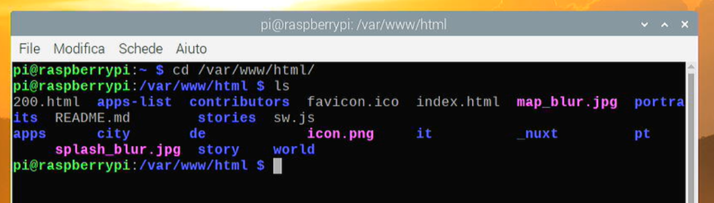
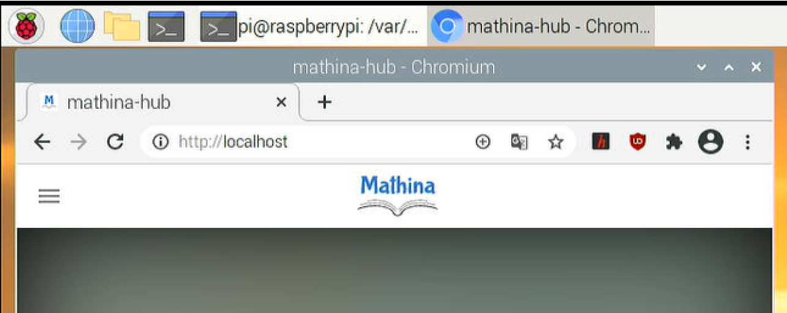
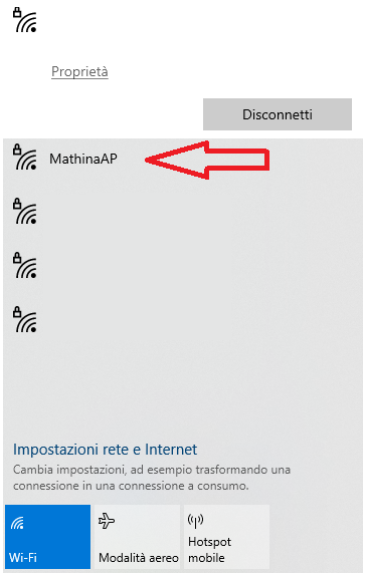
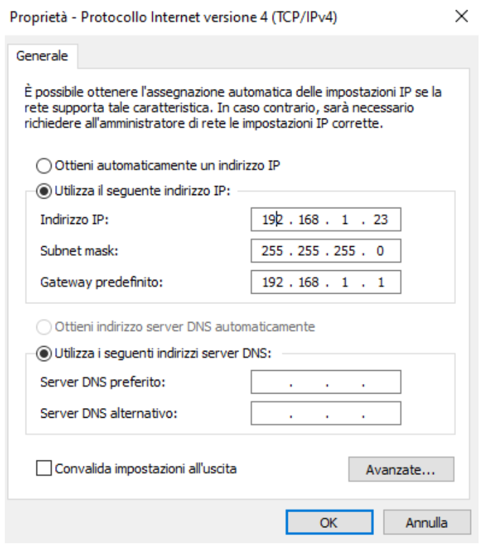

# How to run Mathina on a Raspberry Pi

The following guide explains how to run the Mathina hub on a Raspberry Pi 4 - in the following called **host** - for the purpose of using it in a situation where an internet connection is not available. While the guide is specifically written for a Raspberry Pi 4 with the OEM operating system, the very same operations should work on every debian-based linux distributions. Moreover, the same strategy and the same package with all the files of the Mathina hub, should work on every operating system, with the right modifications.

The guide will follows three main steps:


1. Install a web-server on the host.
2. Copy the package of the Mathina hub to the host.
3. Play with Mathina.

The last step, in particular, will contain three possible solutions for playing with the Project: ([https://github.com/mathina-eu/mathina/releases](https://github.com/mathina-eu/mathina/releases))


1. Play with Mathina directly on the host.
2. Connect the host to a local network, and play with Mathina with another device connected to the same network.
3. Use the host to generate a Wifi access point, and play with Mathina with another device directly connected to the host.


# Step 0 - The Raspberry Pi

The Raspberry Pi ([https://www.raspberrypi.org/](https://www.raspberrypi.org/)) is a powerful and inexpensive hardware, based on linux, which can be used standalone, with screen, mouse and keyboard, as if it were a computer, or can be used to run a webserver on a local network, to overcome the problems of absence of an internet connection. We choose this system for this guide because of the many uses of this system in the education community, and for the very user-friendly approach of the community.


# Step 1 - Install the web-server

A web-server is a piece of software which replies to the queries of a browser web, serving a website over a network. Actually it is much more than that, but for us, it will be the software which will interpret the data of the Mathina hub for all the users.

There is more than one web-server which can be used. We decided to go with the one called NGINX.

[https://www.raspberrypi.org/documentation/remote-access/web-server/nginx.md](https://www.raspberrypi.org/documentation/remote-access/web-server/nginx.md)


```
sudo apt update
sudo apt install nginx
```


```
sudo /etc/init.d/nginx start
```


# Step 2 - Copy the package of the Mathina hub

You can compile the Mathina hub by yourself, following the instructions at [https://github.com/mathina-eu/mathina](https://github.com/mathina-eu/mathina)

For simplicity, the last version of the repository is already compiled in the file mathina-hub.zip here:

You just download this file, copy and extract it to a folder “/ ... / mathina-hub”, and then copy this in the root folder of the webserver, that is **/var/www/html**


```
cd mathina-hub
sudo cp ./ /var/www/html -r
```


Notice that the package of the Mathina hub **must **be copied in the root folder, in particular **/var/www/html **does **not **contain a subfolder mathina-hub, but the content of mathina-hub.zip is directly copied in /var/www/html.





# Step 3 - Play with Mathina

Provided that the user has completed both the previous steps, and that the web server is up and running, the world of Mathina is ready to be explored!


## Step 3A - Play Mathina on the host system

This is probably the easiest setup: just open the browser of the host system (probably chromium, if on Raspberry pi), and go to the url **[http://localhost](http://localhost)**

**You can enjoy reading the stories of Mathina now!**




## Step 3B - Play Mathina via local network

For this step to work, the host system has to be connected to a local network either via LAN or via Wifi. Once is connected, we have to get the IP address of the host system, via the command


```
hostname -I
```


This will be composed of four numbers, usually something like 192.168.1.37, or something similar.

We can then move to the client system - a tablet or a pc, connected to the same network of the host system. Open the browser and go to the url **[http://192.168.1.37](http://192.168.1.37)** (the number being the same IP which has been found on the host system with the previous command).

**You can enjoy reading the stories of Mathina now!**

Notice that depending on the complexity of the network used, this step could become increasingly complicated. For instance usually in large networks permissions are required to access resources directly via their ip address. If this is the case, we recommend to ask to the it personnel for some help.


## Step 3C - Play Mathina on a Wifi access point

In case a local network is not available, it is possible to use the Raspberry Pi to generate a Wireless network, where to access the Mathina hub directly. This process is slightly more complex due to the necessity of changing some system configuration. There are many ways to do that, one of them is by using **hostapd **for handling the access point and possibly **dnsmasq **for handling the DHCP**.**


```
sudo apt update
sudo apt install hostapd
```


There are many tutorial online, which are updated to the most recent versions of these tools, for instance [https://www.raspberrypi.org/documentation/configuration/wireless/access-point-routed.md](https://www.raspberrypi.org/documentation/configuration/wireless/access-point-routed.md) or [https://thepi.io/how-to-use-your-raspberry-pi-as-a-wireless-access-point/](https://thepi.io/how-to-use-your-raspberry-pi-as-a-wireless-access-point/)

We encourage the user to have a look at such tutorials. Here we report the configuration of hostapd which works on a Raspberry Pi 4, software reference 2020-12-02.

Enable the wireless access point service and set it to start when your Raspberry Pi boots:


```
sudo systemctl unmask hostapd
sudo systemctl enable hostapd
```


We will assign the address 192.168.1.1 to the wlan0 interface.


```
sudo nano /etc/dhcpcd.conf
```


Now add the following lines at the end:


```
interface wlan0
static ip_address=192.168.1.1/24
Nohook wpa_supplicant
```


After that, press Ctrl+X, then Y, then Enter to save the file and exit the editor.

Now let’s configure the hostapd software:


```
sudo nano /etc/hostapd/hostapd.conf
```


This is a new file in which you should add the following text:


```
interface=wlan0
hw_mode=g
channel=7
wmm_enabled=0
macaddr_acl=0
auth_algs=1
ignore_broadcast_ssid=0
wpa=2
wpa_key_mgmt=WPA-PSK
wpa_pairwise=TKIP
rsn_pairwise=CCMP
ssid=NETWORK NAME
wpa_passphrase=PASSWORD
```


Instead of “NETWORK NAME” and “PASSWORD” you have to put the name of the Wifi network and the password.

Now let’s tell the system to use this configuration


```
sudo nano /etc/default/hostapd
```


In this file, find the line that says #DAEMON_CONF=”” – delete that # and put the path to our config file in the quotes, so that it looks like this:


```
DAEMON_CONF="/etc/hostapd/hostapd.conf"
```


Now you can just reboot the system and, if needed, start hostapd


```
sudo reboot
sudo systemctl start hostapd
```


Now from the client device you should see the Wifi called “NETWORK NAME”





However, we did not setup **dnsmasq **for handling the DHCP for us, so we need to manually set the gateway and ip on the client side. This is how it look on a Windows system:





The “Gateway” is the ip address specified on the host system while editing **/etc/dhcpcd.conf**

Finally, after connecting to the Wifi, go to the url **[http://192.168.1.1](http://192.168.1.1)**

**You can enjoy reading the stories of Mathina now!**
